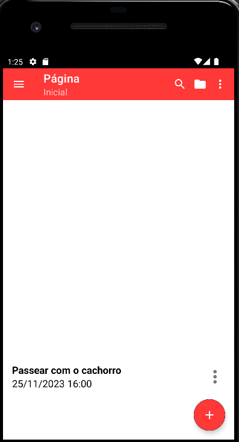

# Lista de itens para se fazer (ToDo)

Nome do Aplicativo: ToDo

O aplicativo ToDo foi desenvolvido como parte de um projeto acadêmico utilizando a linguagem Kotlin. O principal objetivo do aplicativo é proporcionar uma experiência simples e eficiente na gestão de tarefas diárias. Com uma interface intuitiva e amigável, os usuários podem criar, editar e excluir tarefas de maneira fácil.

## Autores

- [Pietro de Araújo Jardim](https://github.com/pietroaraujo03)

## Referência

 - [Barra de APPS (AppBar)](https://developer.android.com/develop/ui/views/components/appbar?hl=pt-br)
 - [Navegação entre Telas](https://www.youtube.com/watch?v=McvhwErPivA&t=854s)
 - [Como Criar uma Toolbar Customizada](https://www.youtube.com/watch?v=EYuwQGhC8zs&t=1092s)
 - [How to make Toolbar in Android Studio](https://www.youtube.com/watch?v=Dt2L6D27PtE)
 - [Criar seu primeiro app](https://developer.android.com/training/basics/firstapp?hl=pt-br)
 - [Adicionando Menu Toolbar Activity](https://www.youtube.com/watch?v=uPdnW0Zxmr4&t=192s)

## Screenshots

 

 

 

